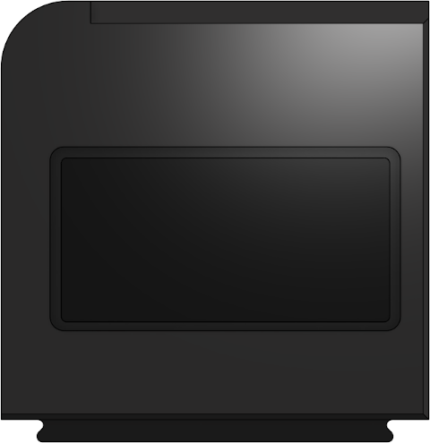
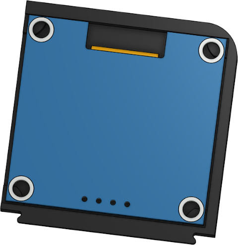
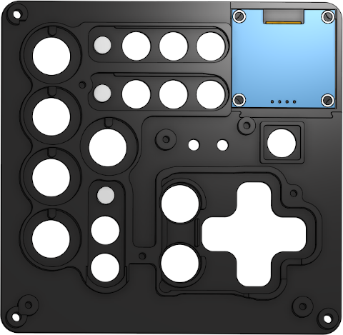
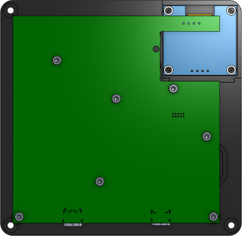
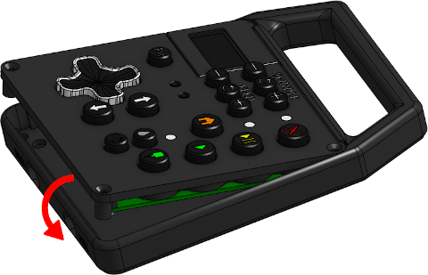
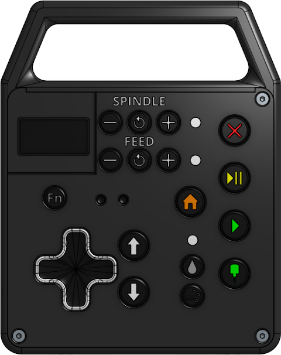

# Jog2k Deluxe Enclosure

## Variants
There are currently three variants of the Jog2K Deluxe, which support slight hardware differences. 
- 'Slim' supports revision A6 (two Type-C connectors), with a 1.3" OLED connected via a short cable.  This is the latest chip-down PCBA from Expatria, and what is shipped from the Expatria shop.
- '1.3in' supports all revisions up to and including A5, with a 1.3" OLED connected via a short cable
- '0.96in' supports all revisions up to and including A5, with a 0.96" OLED connected directly to the PCB via header pins

The differences are all in the enclosure components; the filenames within the Enclosure directory begin with the variant they are suitable for. The same buttons are used for all variants.

The majority of the following instructions are focused on the Slim variant, which is what is currently being shipped from the Expatria shop. The legacy A5 and prior revisions are similar, but do not feature the removable display insert. The assembly section includes notes intended to clarify which variant they apply to.

## Buttons
Buttons are designed for MSLA printing, and are assembled from 2 parts. The 'lightpipe' or 'core', and the 'cover'. Cores should be printed in white, lightpipes in translucent, and covers in black. There is a small amount of clearance designed in to the parts to allow for slight differences in resin tuning. Button pieces can be glued together with a small amount of CA glue if needed. 

In addition to the buttons contained here, there are several sets of community contributed mods for FDM/FFF printed buttons. They can be found in the table in the top-level README. 

## Enclosure
The enclosure is designed to be FDM/FFF printed with a standard 0.4mm nozzle in PLA. Print tolerances are somewhat critical here to avoid excess rotational slop in the buttons; ensure your extrusion multiplier is well tuned for your filament. Materials other than PLA may require compensation for shrinkage. 

The top cover prints best with a single perimeter on the bottom layer; the text gets a bit difficult otherwise, particularly on the A5 and prior enclosures, which have smaller text. There is a checkbox for this in SuperSlicer: Under Quality --> Only One Perimeter check the 'On First Layer' box. 

The Slim variant splits the display section of the cover into a separate insert. An insert for 1.3" displays is provided that should be compatible with most displays available via AliExpress, and a blank insert is provided if you wish to customize the the enclosure for a different display.

There is a recess in the rear of the 0.96" enclosure for a window in the same shape as the base enclosure. It can be cut from acrylic and glued in from the rear, with the lip hiding any glue residue. A window is not required for the 1.3" variant, which mounts the display in a recess in the front panel.

Holes for the fasteners that secure the lid are designed to accept heatset inserts of the Voron typical variety. The board is secured with self-tapping screws, as it is likely to be removed less often and it allows for more wiggle room for print tolerances.

## Enclosure Parts to Print

#### Slim (Rev A6):
- 1x Slim - Bottom Enclosure.stl
- 1x Slim - Top Cover.stl
- 1x Slim - 1.3in Display Insert.stl

#### Rev A5 and Prior with 1.3" OLED:
- 1x 1.3in - Bottom Enclosure.stl
- 1x 1.3in - Top Cover.stl
- 1x 1.3in - Display Retainer.stl

#### Rev A5 and Prior with 0.96" OLED:
- 1x 0.96in - Bottom Enclosure.stl
- 1x 0.96in - Top Cover.stl

## Hardware Required

#### Slim (Rev A6):
- 3x - M3 heatset inserts - 3 x 3 x 5mm - https://www.aliexpress.com/item/1005003286574326.html
- 3x - M3 x 14mm flat head screws  - https://www.aliexpress.com/item/32965177647.html
- 7x - M2.6 x 8mm self tapping screws - https://www.aliexpress.com/item/32970730241.html

#### Rev A5 and Prior:
- 4x - M3 heatset inserts - 3 x 4 x 5mm - https://www.aliexpress.com/item/1005003286574326.html
- 4x - M3 x 16mm flat head screws  - https://www.aliexpress.com/item/32965177647.html
- 7x - M2.6 x 8mm self tapping screws - https://www.aliexpress.com/item/32970730241.html

## Assembly
- Trim/deburr/clean up printed enclosure halves.
- Install heat set inserts into the bottom half of the enclosure.

- **Slim only:** Install display in display insert with hot glue or epoxy, taking care to center the display in the opening. There is a fair bit of tolerance in the recess to allow for slight differences in PCBs and the attachment of the glass OLED to the OLED PCB:

- Clip display insert into top cover, and insert lightpipes. Lightpipes are a fairly tight press fit. Some trimming of the holes may be required if the fit is too tight. A tapered reamer as linked in the Notes section is ideal, or step drill with a 4mm step will also work:

- Insert buttons in all button holes:

- **Rev A5 and prior only:** Align the screen and either heat-stake the plastic mounting pins or use the support bracket.
## DO NOT SOLDER THE SCREEN DIRECTLY TO THE PCB
- **1.3" display versions, including Slim:** Connect screen to PCB via short wires or cable.

- Align PCB with holes/captures
- Insert M2.6 x 8mm self tapping screws where shown and tighten (display cable not shown):

- Flip cover over and ensure all buttons are operational. If any are stuck, loosen screws on PCB and adjust alignment slightly.
- Insert assembled top cover into back enclosure. The slim variant has a lip along the top that captures the edge of the top cover, keeping the display insert in place. The top cover must first be inserted under this lip at a slight angle and pivots down into place: 

- Insert M3 x 14mm **(slim)** or M3 x 16mm **(A5 and prior)** flat head screws and tighten. 

## Notes
- Pretty much any resin type will work. Success has been had with Elegoo Standard, Siraya Tech Fast, and Eryone ABS-like.
The resin buttons may warp slightly at the base as the resin shrinks. The clearances of the cover have been designed such that any warping here shouldn't cause a problem.
- Print the black resin parts last. The resin will shrink in the first day or so after printing, and it will be easier to get them on if the other parts have shrunk a bit first. If print settings are well tuned, the black covers will fit tightly enough after shrinking that they will stay put on their own. 
- Likewise, the buttons may fit too tightly in the enclosure right after printing. They will loosen up a bit after a day or so of resting, when they are at final dimension.
- A tapered reamer of the type typically used for RC car bodyshells is an ideal tool for cleaning up first layer 'squish' in round holes or fine tuning the lightpipe holes. - https://www.aliexpress.com/item/1005003460682946.html They're usually available on Amazon for about $10 too.
- The bolt pattern on the low-cost 1.3 inch OLED screens is not consistent across vendors.  Jog2K Slim PCBA from Expatria are currently shipped with a 1.3 inch OLED from this Aliexpress listing: https://www.aliexpress.com/item/32839718675.html **These displays are only compatible with the Slim enclosure components.**

